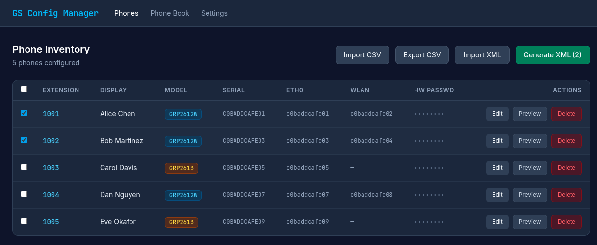

# GrandStream Config Manager

A local web app for managing provisioning XML configurations for GrandStream GRP2612W and GRP2613 VoIP phones, aimed at simplifying deployments for small office and residential environments.

**Security Warning:** This software is intended to run locally and has not been hardened for security. You have been warned, use at your own discretion.



## Mockups

Static HTML mockups are in the [mockups/](mockups/) folder:

| File | Screen |
|---|---|
| [01-phones.html](mockups/01-phones.html) | Phone Inventory |
| [02-phone-edit.html](mockups/02-phone-edit.html) | Phone Edit |
| [02a-phone-edit-sip.html](mockups/02a-phone-edit-sip.html) | Phone Edit — SIP tab |
| [02b-phone-edit-wifi.html](mockups/02b-phone-edit-wifi.html) | Phone Edit — WiFi tab |
| [02c-phone-edit-vpn.html](mockups/02c-phone-edit-vpn.html) | Phone Edit — VPN tab |
| [02d-phone-edit-phonebook.html](mockups/02d-phone-edit-phonebook.html) | Phone Edit — Phonebook tab |
| [02e-phone-edit-personalize.html](mockups/02e-phone-edit-personalize.html) | Phone Edit — Personalize tab |
| [03-phonebook.html](mockups/03-phonebook.html) | Phone Book |
| [04-settings.html](mockups/04-settings.html) | Settings |

## Scope

This tool **generates XML configuration files only**. It does not include a TFTP server, and it does not provision phones directly. Serving the generated files to phones (via TFTP or HTTP) is outside the scope of this project and must be handled separately.

## Features

- **Phone inventory** — import phones via CSV or existing XML config files
- **Per-phone configuration** — SIP accounts (up to 4), WiFi SSIDs (up to 4), virtual programmable keys, phonebook, date/time, screensaver enable, wallpaper source, web access security, and OpenVPN
- **SIP account passwords** — per-account SIP password stored and emitted in the provisioning XML
- **WiFi** — enable/disable, country code (`network.wifi.countryCode`), and up to 4 SSIDs (ESSID, PSK, key management, hidden); key management stored as text (`WPA_PSK`, `OPEN`, etc.) and converted to GrandStream numeric values on XML output
- **OpenVPN** — per-phone VPN configuration (server, port, transport, cipher, CA cert, client cert, client key)
- **XML element hints** — every form field shows the exact GrandStream XML item and part it maps to
- **CSV export** — download the current phone inventory in the same import-compatible CSV format
- **XML generation** — generate delta provisioning XML per phone, selectable from the inventory, with files named `{SIP_ID}.xml`, `cfg{ETH0_MAC}.xml`, and `cfg{WLAN_MAC}.xml` (where applicable), plus archived copies under `archive/<timestamp>/`
- **Phone Book** — auto-generated from the phone inventory, with support for additional custom entries, with `phonebook.xml` archived under `archive/<timestamp>/`
- **Settings** — configurable output directory and default SIP/phonebook server addresses

## Requirements

- Python 3.9+
- Dependencies listed in `requirements.txt`

## Setup

```bash
pip install -r requirements.txt
uvicorn main:app --reload
```

Then open [http://localhost:8000](http://localhost:8000).

## CSV Import Format

```
account,subscriber_name,subscriber_id,model,serial,hw_passwd,eth0,wlan
Office,Alice,1000,GRP2612W,aabbcc001122,admin123,aabbcc001122,aabbcc001133
```

| Column | Description |
|---|---|
| `account` | Account / group label (stored in `endpoints.account`) |
| `subscriber_name` | Display name shown on the phone |
| `subscriber_id` | SIP extension / user ID |
| `model` | `GRP2612W` or `GRP2613` |
| `serial` | Device serial number (used as upsert key) |
| `hw_passwd` | Factory/hardware admin password |
| `eth0` | Ethernet MAC address |
| `wlan` | WiFi MAC address (optional) |

## XML Output

Generated files are written to the configured output directory (default `./output`). Three files are written per phone — named by SIP extension, Ethernet MAC, and WiFi MAC (where applicable):

```
1000.xml             # by SIP extension
cfgaabbcc001122.xml  # by eth0 MAC
cfgaabbcc001133.xml  # by wlan MAC (GRP2612W only)
```

Archived copies are also written to `archive/<timestamp>/` on each generation run. The phonebook is written as `phonebook.xml`.

### Serving via TFTP

Grandstream phones fetch their config by MAC address — they request `cfg<mac>.xml` (lowercase, no separators). Because the tool already generates files with those exact names, no symlinks are needed. Copy the contents of the output directory to your TFTP server root and phones will find their configs automatically.

## XML Values: Stored vs Hard-coded

Most XML output values come from the database and are editable in the UI. A few are fixed at generation time:

| XML element / part | Value | Source |
|---|---|---|
| `account.N → enable` | always `Yes` | Hard-coded — account is only emitted when enabled in DB; the part value is always `Yes` |
| `account.N.sip.subscriber → userid` | same as extension | Hard-coded — always set equal to the SIP user ID |
| `network.wifi → enable` | `1` / omitted | DB (`wifi_enabled`) — account is only emitted when enabled |
| `network.wifi.ssid.N → eap_method` | always `0` | Hard-coded — EAP not configurable |
| `pks.vpk.N → lockmode` | always `No` | Hard-coded |
| `security.webaccess.session → timeout` | DB (`webaccess_timeout`, default `60`) | Configurable in Security tab |
| `security.webaccess.session → authtimeout` | DB (`webaccess_authtimeout`, default `60`) | Configurable in Security tab |
| `security.webaccess.session → accesstimeout` | DB (`webaccess_accesstimeout`, default `60`) | Configurable in Security tab |
| WiFi key management | numeric (`0`–`4`) | Converted from text stored in DB (`OPEN`→`0`, `WPA_PSK`→`4`, etc.) |

`wifi_band` is stored in the database and shown in the WiFi tab but is not currently emitted in the XML output.

## Database Schema

| Table | Key columns | Description |
|---|---|---|
| `endpoints` | `account`, `extension`, `display_name`, `model`, `serial`, `mac_eth0`, `mac_wlan`, `factory_password` | Phone/endpoint records (previously `phones`) |
| `endpoint_config` | `phonebook_*`, `wifi_*`, `vpn_*`, `datetime_*`, `wallpaper_source`, `screensaver_enabled`, `sip_notify_challenge`, `webaccess_*` | Per-endpoint provisioning configuration (previously `phone_configs`) |
| `sip_accounts` | `account_num`, `enabled`, `extension`, `subscriber_name`, `display_name`, `password`, `sip_server_1`, `sip_server_2`, `voicemail_number` | SIP accounts (up to 4 per endpoint) |
| `wifi_ssids` | `ssid_num`, `enabled`, `essid`, `psk`, `key_mgmt`, `hidden` | WiFi SSID entries (up to 4 per endpoint; GRP2612W only) |
| `vpk_keys` | `slot`, `keymode`, `description`, `value`, `account` | Virtual programmable key assignments |
| `phonebook_entries` | `first_name`, `phone_number`, `account_index` | Global phone book entries |
| `app_settings` | `key`, `value` | Application-level settings (output dir, defaults) |

Child tables (`sip_accounts`, `wifi_ssids`, `endpoint_config`, `vpk_keys`) reference `endpoints` via an `endpoint_id` foreign key with indexes on all FK columns.

The `init_db()` function in `database.py` handles all schema migrations automatically on startup, including table/column renames and stale column removal from prior development iterations.

## P-Values and Firmware Parameters

GrandStream firmware identifies each configuration parameter with a numeric P-value (e.g., `P8387` = "Show Date on Status Bar"). These P-values appear in `*.txt` provisioning files.

This tool uses the XML provisioning format (`gs_provision` / `config` / `item` / `part`), which is the primary format for GrandStream delta provisioning. P-value annotations are:

- Documented as inline comments in `xml_generator.py`
- Stored as `pvalue="P…"` attributes in the example XML files under `data/`
- Cross-referenced in `data/GRP2612W.txt` and `data/GRP2613.txt`

**Decision:** P-values are not stored in the database — they are static firmware metadata that changes only on major firmware upgrades. The OEM parameter definition files in `data/OEM-GRP2612W-1.0.13.127.xml` and `data/OEM-GRP2613-1.0.13.127.xml` serve as the authoritative reference.

### Key P-Value Reference

| Parameter | P-Value | Valid Values |
|---|---|---|
| Show Date on Status Bar | P8387 | 0=No Date, 1=Short Date, 2=Full Date |
| Date format | P102 | 0=yyyy-mm-dd, 1=mm-dd-yyyy, 2=dd-mm-yyyy |
| Time format | P122 | 0=24Hour, 1=12Hour |
| Screensaver enable | P2970 | 0=disabled, 1=enabled |
| Wallpaper source | P2916 | 1=Default, 2=FromServer, 4=Color |
| Phonebook download mode | P330 | 0=Off, 1=HTTP, 2=TFTP, 3=HTTPS |
| Phonebook download server | P331 | string |
| Phonebook sync interval (min) | P332 | integer |
| SIP notify challenge | P4428 | 0=No, 1=Yes |
| WiFi enable | P7800 | 0/1 |
| WiFi country code | P7831 | string (e.g. `US`) |
| WiFi SSID 0 essid | P83000 | string |
| WiFi SSID 0 key mgmt | P83002 | 0=OPEN, 1=WEP, 4=WPA_PSK |
| OpenVPN enable | P7050 | No/Yes |
| OpenVPN server | P7051 | string |
| OpenVPN port | P7052 | integer |

## Phone Models

| Model | WiFi | VPK Slots |
|---|---|---|
| GRP2612W | Yes (up to 4 SSIDs) | 4 |
| GRP2613 | No | 6 |

## Project Structure

```
main.py                 FastAPI routes
models.py               SQLAlchemy models (tables: endpoints, endpoint_config, …)
database.py             DB init and schema migrations
csv_importer.py         CSV import/export logic
xml_generator.py        Provisioning XML generation (includes pvalue reference)
xml_importer.py         XML config import/parsing
phonebook_generator.py  Phonebook XML generation
templates/              Jinja2 HTML templates
data/                   Reference configs and OEM parameter definitions
docs/                   Firmware release notes PDF
start-script.sh         Convenience launcher
output/                 Generated XML files (gitignored)
```

## License

MIT — see [LICENSE](LICENSE).
